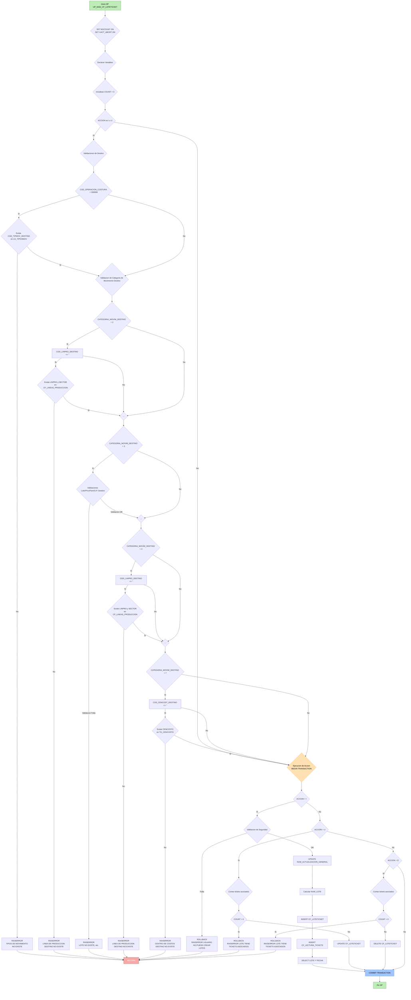
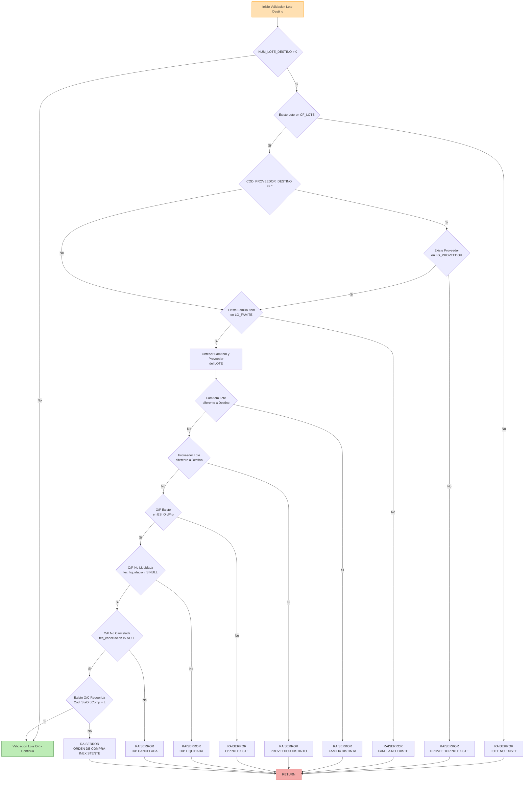

# README TÉCNICO

**Stored Procedure:** `[dbo].[UP_MAN_CF_LOTETICKET]`  
**Autor:** Julio Albert Bendezú Gutiérrez  
**Fecha:** 2025-12-05

## Descripción
Este documento resume el análisis técnico-funcional del Stored Procedure `UP_MAN_CF_LOTETICKET`. Su objetivo es proporcionar una referencia rápida sobre propósito, uso, reglas de negocio, parámetros y consideraciones para desarrolladores que integren o mantengan esta lógica en .NET, SQL Server u otras plataformas.

## Tabla de Contenidos
- [Resumen Ejecutivo](#resumen-ejecutivo)
- [Objetivo Funcional](#objetivo-funcional)
- [Parámetros Principales](#parámetros-principales)
- [Tablas Involucradas](#tablas-involucradas)
- [Reglas de Negocio](#reglas-de-negocio)
- [Flujo General por Acción](#flujo-general-por-acción)
- [Pseudocódigo Detallado](#pseudocódigo-detallado)
- [Manejo de Errores y Transacciones](#manejo-de-errores-y-transacciones)
- [Mejoras Técnicas](#mejoras-técnicas)
- [Recomendaciones de Integración con .NET](#recomendaciones-de-integración-con-net)
- [Conclusión](#conclusión)
- [Diagramas de Flujo](#diagramas-de-flujo)

## Resumen Ejecutivo
`UP_MAN_CF_LOTETICKET` gestiona la creación, actualización y eliminación de lotes de tickets dentro de un flujo productivo industrial (costura, proveedores, familias de ítems, órdenes de compra y producción). Soporta las acciones:
- `I` — Insert
- `U` — Update
- `D` — Delete

Cada acción se ejecuta con validaciones para garantizar integridad, consistencia y cumplimiento de reglas de negocio.

## Objetivo Funcional
El Stored Procedure asegura que:
- Los registros creados o modificados correspondan a entidades válidas (proveedores, familias, OP, OC, sectores, líneas, centros de costo).
- No existan duplicados por fecha, operación y usuario.
- No se modifiquen/eliminen lotes con tickets asociados.
- Se mantenga consistencia transaccional mediante `COMMIT`/`ROLLBACK`.
- Se registre auditoría cuando corresponda.

## Parámetros Principales

| Parámetro | Tipo de Dato | Longitud | Obligatorio | Descripción |
|-----------|--------------|----------|------------|------------|
| `@ACCION` | `CHAR` | 1 | Sí | `I` (Insert), `U` (Update), `D` (Delete). |
| `@FEC_LOTETICKET` | `DATETIME` | - | Sí | Fecha del lote/documento. |
| `@NUM_LOTE` | `INT` | - | No | Número de lote (generado automáticamente en INSERT). |
| `@COD_OPERACION_COSTURA` | `CHAR` | 6 | Sí | Código de operación productiva asociada al lote. |
| `@COD_USUARIO` | `VARCHAR` | 50 | Sí | Usuario ejecutor de la operación (referencia a tabla de seguridad). |
| `@PC` | `VARCHAR` | 20 | No | Nombre de la máquina/PC desde donde se ejecuta. |
| `@CATEGORIA_MOVIM_DESTINO` | `CHAR` | 1 | No | Define tipo de movimiento (1, 2, 3, 4, 7). Valor por defecto: `'1'`. |
| `@COD_TIPMOV_DESTINO` | `VARCHAR` | 10 | No | Código tipo de movimiento (validado si operación es '999999'). |
| `@COD_SECTOR_DESTINO` | `CHAR` | 2 | No | Sector de costura (requerido para categoría 2 o 4). |
| `@COD_LINPRO_DESTINO` | `CHAR` | 3 | No | Línea de producción (validado para categoría 2 o 4). |
| `@COD_PROVEEDOR_DESTINO` | `VARCHAR` | 10 | No | Identificador del proveedor (requerido para categoría 3). |
| `@COD_FAMITEM_DESTINO` | `VARCHAR` | 10 | No | Familia o categoría del ítem (requerido para categoría 3). |
| `@NUM_LOTE_DESTINO` | `INT` | - | No | Número de lote destino (opcional, validado si > 0 en categoría 3). |
| `@COD_CENCOST_DESTINO` | `VARCHAR` | 10 | No | Centro de costos (validado para categoría 7). |
| `@TIP_PTMP_DESTINO_ASOCIADO` | `CHAR` | 2 | No | Tipo de parámetro destino asociado. |
| `@SER_ORDCOMP_DESTINO` | `VARCHAR` | 3 | No | Serie de orden de compra destino. |
| `@COD_ORDCOMP_DESTINO` | `VARCHAR` | 10 | No | Código de orden de compra destino. |
| `@COD_ORDPRO_DESTINO` | `VARCHAR` | 10 | No | Código de orden de producción (requerido para categoría 3). |

> **Nota:** Los parámetros marcados como "No obligatorio" pueden tener valores por defecto `''` (cadena vacía) o `0` (número). Su validación depende de la `@CATEGORIA_MOVIM_DESTINO` y `@ACCION` ejecutada.

## Tablas Principales Involucradas
- `CF_LOTETICKET` — Tabla principal del lote.
- `CF_LECTURA_TICKETS` — Auditoría de lecturas/tickets.
- `PROVEEDOR`, `ITEM_FAMILIA`, `OPCAB`, `OCPEDCAB` — Tablas maestras y de órdenes.
- Tablas relacionadas a `SECTORES`, `LINEAS`, `CENTROS_DE_COSTO`.

## Reglas de Negocio

### Reglas generales
- Un lote no puede modificarse o eliminarse si tiene tickets asociados.
- Los lotes deben ser únicos por combinación de fecha, operación y usuario.
- Validaciones específicas según la categoría de movimiento.
- Control de permisos para inserciones y cambios.
- Integridad entre proveedor, familia, OP, OC y destino del lote.

### Validaciones por categoría (resumen)
- Categoría 1: Validación de tipo de movimiento.
- Categorías 2 y 4: Validación de sector, línea y asociaciones.
- Categoría 3: Validaciones complejas (proveedor, familia, OP, OC, consistencia destino).
- Categoría 7: Validación de centros de costo.

## Flujo General por Acción

### INSERT (`I`)
- Verificar permisos de inserción.
- Comprobar duplicados (fecha/operación/usuario).
- Generar número de lote (según reglas internas).
- Insertar registro en `CF_LOTETICKET`.
- Registrar auditoría en `CF_LECTURA_TICKETS` (si aplica).

### UPDATE (`U`)
- Validar existencia del lote.
- Rechazar si existen tickets asociados.
- Revalidar entidades relacionadas (proveedor, familia, OP, OC, sector, línea, centro de costo).
- Actualizar datos del lote.
- Registrar auditoría de cambios (si aplica).

### DELETE (`D`)
- Rechazar si existen tickets asociados.
- Eliminar el lote (o marcar como inactivo según política).
- Registrar auditoría de eliminación (si aplica).

## Pseudocódigo Detallado

A continuación se presenta el pseudocódigo estructurado del procedimiento `UP_MAN_CF_LOTETICKET`, que detalla la lógica de validación y ejecución:

```sql
PROCEDIMIENTO UP_MAN_CF_LOTETICKET (
    // Parámetros de Acción y Lote
    @ACCION CHAR(1),
    @FEC_LOTETICKET DATETIME,
    @NUM_LOTE INT,
    @COD_OPERACION_COSTURA CHAR(6),
    @COD_USUARIO COD_USUARIO,
    @PC VARCHAR(20),
    
    // Parámetros de Destino
    @CATEGORIA_MOVIM_DESTINO CHAR(1) = '1',
    @COD_TIPMOV_DESTINO COD_TIPMOV = '',
    @COD_SECTOR_DESTINO CHAR(2) = '',
    @COD_LINPRO_DESTINO CHAR(3) = '',
    @COD_PROVEEDOR_DESTINO COD_PROVEEDOR = '',
    @COD_FAMITEM_DESTINO COD_FAMITEM = '',
    @NUM_LOTE_DESTINO INT = 0,
    @COD_CENCOST_DESTINO COD_CENCOST = '',
    @TIP_PTMP_DESTINO_ASOCIADO CHAR(2) = '',
    @SER_ORDCOMP_DESTINO SER_ORDCOMP = '',
    @COD_ORDCOMP_DESTINO COD_ORDCOMP = '',
    @COD_ORDPRO_DESTINO COD_ORDPRO = ''
)
INICIO

    // 1. Configuración Inicial y Declaración
    SET NOCOUNT ON
    SET XACT_ABORT ON
    
    DECLARAR @NUM_ACTUALIZACION_GENERAL, @COUNT, @COD_FAMITEM_LOTE, @COD_PROVEEDOR_LOTE
    SET @COUNT = 0

    // 2. Validaciones de Destino (Solo para Inserción 'I' o Actualización 'U')
    SI @ACCION es 'I' o 'U' ENTONCES
        
        // 2.1 Validación de Tipo de Movimiento (Operación de Costura '999999')
        SI @COD_OPERACION_COSTURA es '999999' ENTONCES
            SI NO EXISTE @COD_TIPMOV_DESTINO en LG_TIPOSMOV ENTONCES
                RAISERROR ('TIPOS DE MOVIMIENTO NO EXISTE. REVISAR')
                RETORNAR
            FIN SI
        FIN SI

        // 2.2 Validación por Categoría de Movimiento Destino
        
        // Categoría '2' o '4': Línea de Producción
        SI @CATEGORIA_MOVIM_DESTINO es '2' o '4' ENTONCES
            SI @COD_LINPRO_DESTINO <> '' ENTONCES
                SI NO EXISTE @COD_LINPRO_DESTINO y @COD_SECTOR_DESTINO en CF_LINEAS_PRODUCCION ENTONCES
                    RAISERROR ('LA LINEA DE PRODUCCION DESTINO NO EXISTE')
                    RETORNAR
                FIN SI
            FIN SI
        FIN SI

        // Categoría '3': Lote, Proveedor y Orden de Producción (Validación Compleja)
        SI @CATEGORIA_MOVIM_DESTINO es '3' ENTONCES
            // a. Validar Lote Destino
            SI @NUM_LOTE_DESTINO > 0 Y NO EXISTE @NUM_LOTE_DESTINO en CF_LOTE ENTONCES
                RAISERROR ('LOTE NO EXISTE. REVISAR') ; RETORNAR
            FIN SI

            // b. Validar Proveedor Destino
            SI @COD_PROVEEDOR_DESTINO no es NULO o vacío Y NO EXISTE en LG_PROVEEDOR ENTONCES
                RAISERROR ('PROVEEDOR DESTINO NO EXISTE. REVISAR') ; RETORNAR
            FIN SI

            // c. Validar Familia de Ítem
            SI NO EXISTE @COD_FAMITEM_DESTINO en LG_FAMITE ENTONCES
                RAISERROR ('FAMILIA ORIGEN NO EXISTE. REVISAR') ; RETORNAR
            FIN SI

            // d. Comparar atributos del Lote con Destino
            OBTENER @COD_FAMITEM_LOTE y @COD_PROVEEDOR_LOTE de CF_LOTE para @NUM_LOTE_DESTINO
            SI @COD_FAMITEM_LOTE <> @COD_FAMITEM_DESTINO ENTONCES
                RAISERROR ('FAMILIA DISTINTA AL LOTE') ; RETORNAR
            FIN SI
            SI @COD_PROVEEDOR_LOTE <> @COD_PROVEEDOR_DESTINO ENTONCES
                RAISERROR ('PROVEEDOR DISTINTO AL LOTE') ; RETORNAR
            FIN SI
            
            // e. Validar Orden de Producción (O/P)
            SI NO EXISTE @COD_ORDPRO_DESTINO en ES_OrdPro ENTONCES
                RAISERROR ('O/P NO EXISTE') ; RETORNAR
            FIN SI
            SI O/P EXISTE y fec_liquidacion NO es NULO ENTONCES
                RAISERROR ('O/P LIQUIDADA') ; RETORNAR
            FIN SI
            SI O/P EXISTE y fec_cancelacion NO es NULO ENTONCES
                RAISERROR ('O/P CANCELADA') ; RETORNAR
            FIN SI
            
            // f. Validar Orden de Compra (O/C) Requerida Asociada
            SI NO EXISTE O/C LIGADA a O/P, Proveedor y FamItem con Cod_StaOrdComp = 'L' ENTONCES
                RAISERROR ('ORDEN DE COMPRA INEXISTENTE .REVISAR') ; RETORNAR
            FIN SI
        FIN SI

        // Categoría '7': Centro de Costos
        SI @CATEGORIA_MOVIM_DESTINO es '7' ENTONCES
            SI @COD_CENCOST_DESTINO <> '' Y NO EXISTE @COD_CENCOST_DESTINO en TG_CENCOSTO ENTONCES
                RAISERROR ('CENTRO DE COSTOS DESTINO NO EXISTE. REVISAR') ; RETORNAR
            FIN SI
        FIN SI
        
    FIN SI

    // 3. Bloque de Transacción y Ejecución de Acciones
    BEGIN TRANSACTION

    // ACCIÓN 'I' (INSERTAR)
    SI @ACCION es 'I' ENTONCES
        // 3.1. Validación de Seguridad para Inserción
        SI NO EXISTE @COD_USUARIO y @COD_OPERACION_COSTURA en CF_SEGURIDAD_LECTURA_TICKETS_LOTE ENTONCES
            ROLLBACK ; RAISERROR ('USUARIO NO PUEDE CREAR LOTES') ; RETORNAR
        FIN SI

        // 3.2. Obtener Nueva Numeración
        ACTUALIZAR NUM_ACTUALIZACION_GENERAL en CF_CONTROL
        SET @NUM_LOTE = MAX(NUM_LOTE) de CF_LOTETICKET para @FEC_LOTETICKET
        SET @NUM_LOTE = ISNULL(@NUM_LOTE, 0) + 1

        // 3.3. Inserciones
        INSERTAR en CF_LOTETICKET (con todos los parámetros)
        INSERTAR en CF_LECTURA_TICKETS (para auditoría)
        
        // 3.4. Retornar Lote Creado
        SELECCIONAR @FEC_LOTETICKET, @NUM_LOTE

    // ACCIÓN 'U' (ACTUALIZAR)
    SINO SI @ACCION es 'U' ENTONCES
        // 3.5. Validar Lote sin Tickets Asociados
        OBTENER @COUNT de tickets en CF_ORDPRO_TICKET para el lote actual
        SI @COUNT > 0 ENTONCES
            ROLLBACK ; RAISERROR ('LOTE TIENE TICKETS ASOCIADOS. ELIMINE PRIMERO LOS TICKETS') ; RETORNAR
        FIN SI
        
        // 3.6. Actualizar
        ACTUALIZAR CF_LOTETICKET SET (TODOS LOS CAMPOS DE DESTINO)
        DONDE FEC_LOTETICKET = @FEC_LOTETICKET y NUM_LOTE = @NUM_LOTE

    // ACCIÓN 'D' (ELIMINAR)
    SINO SI @ACCION es 'D' ENTONCES
        // 3.7. Validar Lote sin Tickets Asociados
        OBTENER @COUNT de tickets en CF_ORDPRO_TICKET para el lote actual
        SI @COUNT > 0 ENTONCES
            ROLLBACK ; RAISERROR ('LOTE TIENE TICKETS ASOCIADOS. ELIMINE PRIMERO LOS TICKETS') ; RETORNAR
        FIN SI

        // 3.8. Eliminar
        ELIMINAR de CF_LOTETICKET
        DONDE FEC_LOTETICKET = @FEC_LOTETICKET y NUM_LOTE = @NUM_LOTE
    FIN SI

    // 4. Cierre de Transacción
    COMMIT TRANSACTION

FIN PROCEDIMIENTO
```
> Notas sobre el pseudocódigo
- **Configuración inicial:** `SET NOCOUNT ON` (elimina mensajes de filas afectadas) y `SET XACT_ABORT ON` (detiene ejecución ante errores) optimizan rendimiento y controlan comportamiento transaccional.
- **Validaciones previas:** Se ejecutan solo para acciones de inserción (`I`) y actualización (`U`); la acción delete (`D`) solo verifica tickets asociados.
- **Control de transacciones:** Usa `BEGIN TRANSACTION`, `ROLLBACK` y `COMMIT` para garantizar que todas las operaciones se ejecuten como una unidad atómica.
- **Manejo de errores:** Cada validación fallida genera un `RAISERROR` descriptivo que detiene la ejecución e inicia automáticamente `ROLLBACK`.

## Manejo de Errores y Transacciones
- Inicio con `BEGIN TRAN`.
- `ROLLBACK` ante cualquier error o validación fallida.
- `COMMIT` si la operación concluye correctamente.
- Mensajes descriptivos para:
  - Entidades inexistentes.
  - Inconsistencias proveedor–familia–lote.
  - Lote en uso (no modificable).
  - Falta de permisos.
  - Parámetros obligatorios faltantes.

## Posibles Mejoras Técnicas
- Modularizar validaciones en funciones o SPs auxiliares.
- Normalizar nombres de variables y parámetros.
- Centralizar mensajes de error en una tabla o catálogo (para i18n y mantenibilidad).
- Crear vistas o UDFs para validaciones recurrentes.
- Añadir pruebas unitarias/procedimientos de validación en un entorno de desarrollo.

## Recomendaciones de Integración con .NET
- Implementar una capa de acceso a datos (DAL) para invocar el SP con `SqlCommand` parametrizado.
- Usar DTOs para representar input/output del SP.
- Exponer operaciones mediante una API REST en ASP.NET Core si se requiere acceso desde front-end/Apps móviles.
- Para cargas masivas, usar procedimientos parametrizados y batching controlado.
- Manejar transacciones desde la capa .NET sólo si se requiere coordinación con otras operaciones.

## Conclusión
`UP_MAN_CF_LOTETICKET` es un SP crítico que centraliza la lógica de gestión de lotes de tickets en un entorno productivo. Garantiza validaciones empresariales, integridad transaccional y registros de auditoría. La documentación y las sugerencias incluidas facilitan mantenimiento, refactorización e integración con aplicaciones modernas.

## Contacto / Autor
- **Autor:** Julio Albert Bendezú Gutiérrez  
- **Fecha del documento:** 2025-12-05

## Diagramas de Flujo

### Flujo General del Stored Procedure UP_MAN_CF_LOTETICKET (I, U, D) y Validaciones de Destino

Diagrama que representa toda la lógica principal del procedimiento, incluyendo validaciones de destino y las tres acciones posibles (Insert, Update, Delete):

**Diagrama Interactivo:**


Descargar PNG:
[Descargar Flujo General PNG](./diagrams/Flujo%20General%20del%20Stored%20Procedure%20UP_MAN_CF_LOTETICKET%20(I,%20U,%20D)%20y%20Validaciones%20de%20Destino.png)

### Validaciones Específicas del Lote Destino (Categoría 3)

Diagrama que detalla las validaciones específicas realizadas cuando la categoría de movimiento destino es `3`, asegurando la consistencia y validez de los datos antes de realizar la inserción o actualización del lote:


Descargar PNG:
[Descargar Categoría 3 PNG](./diagrams/Detalle%20del%20Flujo%20de%20Validación%20para%20Categoría%20de%20Movimiento%20Destino%20'3'%20(Lote%20Destino).png)